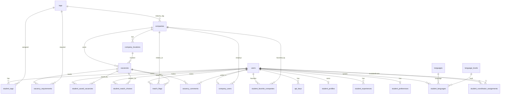

# Data model (ERD)

This document summarizes the main entity groups and key relationships. The full schema is defined in DBML: **[schema.dbml](schema.dbml)**. You can view an ERD by importing that file into [dbdiagram.io](https://dbdiagram.io).
Alternatively you can view it at [complete ERD in dbdiagram.io](https://dbdiagram.io/d/De-Ballenbak-van-TLE3-Team4-69a58819a3f0aa31e186ba80).

## Diagram (used tables)

## Entity groups

### Users & auth

- **users** — All users (role: student, company, coordinator, admin, dev). Fields: id, role, email, password_hash, first_name, middle_name, last_name, phone, profile_photo_url.
- **api_keys** — API keys for v2 (user_id, key_hash, plain_key preview, is_active, last_used_at). Referenced by user.

### Companies

- **companies** — Company records (name, industry_tag_id, email, phone, size_category, photo_url, banner_url, description, is_active).
- **company_locations** — Addresses per company (company_id, address_line, postal_code, city, country, lat, lon, is_primary).
- **company_users** — Links users to companies (user_id, company_id, job_title). One user can be linked to one company.

### Vacancies & tags

- **tags** — Tag master data (name, tag_type, is_active). Used for skills, traits, majors, industry, etc.
- **vacancies** — Vacancies belong to a company (company_id, location_id, title, hours_per_week, description, offer_text, expectations_text, status, is_active).
- **vacancy_requirements** — Many-to-many: vacancy ↔ tag with requirement_type (must_have / nice_to_have) and importance (1–5). Composite PK (vacancy_id, tag_id, requirement_type).

### Students

- **student_profiles** — One per student user (user_id PK, headline, bio, address, city, country, searching_status, exclude_demographics, exclude_location).
- **student_experiences** — Work/education history (student_user_id, title, company_name, start_date, end_date, description).
- **student_tags** — Student’s tags with weight (student_user_id, tag_id, is_active, weight). Composite PK (student_user_id, tag_id).
- **student_preferences** — Desired role, hours, distance, drivers license, compensation, notes.
- **student_favorite_companies** — Student ↔ company (student_user_id, company_id). Composite PK.
- **student_saved_vacancies** — Student ↔ vacancy (student_user_id, vacancy_id, removed_at). Composite PK.
- **languages**, **language_levels** — Lookup tables.
- **student_languages** — Student’s languages with level (student_user_id, language_id, language_level_id). Composite PK.

### Matching & AI (schema support; live matching is on-demand)

- **ai_prompts** — Named prompt templates (name, template_text).
- **ai_runs** — Batch run metadata (model_id, prompt_id, run_type, criteria_version_id, created_by_user_id, notes).
- **ai_criteria_versions** — Named criteria versions (name, description, created_by_user_id, is_active).
- **ai_criteria_rules** — Per-version rules (criteria_version_id, feature_type, weight, min_required, penalty_if_missing).
- **match_vacancy_scores** — Persisted scores per run (run_id, student_user_id, vacancy_id, match_score, full_analysis_text). Used when batch runs are implemented.
- **match_vacancy_factors** — Per-score factor breakdown (match_vacancy_score_id, factor_label, impact, polarity, factor_type, tag_id).

### Coordination & fairness

- **match_flags** — Student disputes (student_user_id, company_id, vacancy_id, disputed_factor, message, status, coordinator_user_id, resolution_note).
- **bias_alerts** — Alerts on possible bias (company_id, vacancy_id, alert_type, must_have_snapshot, remaining_candidates, bias_tip, status, coordinator_user_id).
- **match_overrides** — Coordinator overrides (coordinator_user_id, student_user_id, company_id, vacancy_id, action, reason, expires_at).
- **manual_placements** — Placements outside the platform (student_user_id, company_name, contact_email, description, start_date, status, coordinator_user_id, notes).
- **student_match_choices** — Student’s choice per vacancy (student_user_id, vacancy_id, source_run_id, source_match_score_id, status: shortlisted/requested/approved/rejected/withdrawn, decided_by_user_id, decision_note).
- **student_coordinator_assignments** — Which coordinator is assigned to which student (student_user_id, coordinator_user_id, assigned_at, unassigned_at, assigned_by_user_id).
- **vacancy_comments** — Coordinator/admin comments on vacancies (vacancy_id, author_user_id, comment).

### Conversations

- **conversations** — Typed conversations (conversation_type: vacancy_chat, student_admin, admin_company; vacancy_id, company_id, student_user_id, admin_user_id; created_by_user_id).
- **messages** — Messages in a conversation (conversation_id, sender_user_id, body).

## Key relationships (summary)

- **users** → roles; **api_keys** → users.
- **companies** → industry **tag**; **company_locations** → company; **company_users** → user, company.
- **vacancies** → company, optional **company_location**; **vacancy_requirements** → vacancy, **tag**.
- **student_profiles**, **student_experiences**, **student_tags**, **student_preferences**, **student_favorite_companies**, **student_saved_vacancies**, **student_languages** → **users** (student); **student_tags** / **student_preferences** → **tags**; **student_languages** → **languages**, **language_levels**.
- **ai_runs** → **ai_prompts**, **ai_criteria_versions**, **users**; **match_vacancy_scores** → **ai_runs**, **users**, **vacancies**; **match_vacancy_factors** → **match_vacancy_scores**, **tags**.
- **match_flags**, **bias_alerts**, **match_overrides** → users, companies, vacancies as applicable; **manual_placements** → student user, coordinator user; **student_match_choices** → student user, vacancy, optional **ai_runs** / **match_vacancy_scores**, **users** (decided_by); **student_coordinator_assignments** → student user, coordinator user.
- **conversations** → vacancy, company, users (student, admin, created_by); **messages** → **conversations**, **users** (sender).

## Excluded (unused today)

These tables exist in the schema and have models, but are **not shown in the Mermaid diagram** because they currently have **no API routes/controllers** using them.

- **AI / batch runs & persisted scores**: `ai_prompts`, `ai_runs`, `ai_criteria_versions`, `ai_criteria_rules`, `match_vacancy_scores`, `match_vacancy_factors`
- **Messaging**: `conversations`, `messages`
- **Coordination extensions**: `bias_alerts`, `match_overrides`, `manual_placements`

For column-level detail and indexes, see **[schema.dbml](schema.dbml)**.
